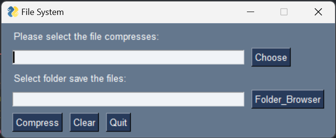
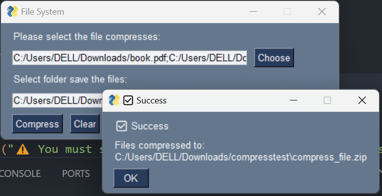

# 📦 ZipFile

A lightweight desktop app to create ZIP archives through a graphical interface using Python and FreeSimpleGUI.

## 🧰 Description

**ZipFile** is a simple GUI application built with [FreeSimpleGUI](https://pypi.org/project/FreeSimpleGUI/) that allows users to compress multiple files into a single `.zip` archive.

With just a few clicks, you can:
- Select multiple files from your system.
- Choose a destination folder.
- Create a ZIP file named `compress_file.zip`.

The interface is intuitive and beginner-friendly — perfect for users who want a quick solution for file compression without using the command line.

## 🚀 Features

✅ Multi-file selection using `sg.FilesBrowse`  
✅ Destination folder selection using `sg.FolderBrowse`  
✅ Error handling and success messages with popups  
✅ ZIP creation using Python's built-in `zipfile` module  
✅ Simple and clean graphical interface

## 🖥️ Screenshot (Optional)

> 
> 

## 🧪 How to Use

1. Make sure you have Python installed.
2. Install `FreeSimpleGUI`:
   ```bash
   pip install FreeSimpleGUI
   ```
3. Run the script below.

## 📄 Code

```python
import FreeSimpleGUI as sg
import zipfile
import os

layout = [[sg.Text('Please select the file compresses:')],
          [sg.Input(key='-Input-Chose-File-'), sg.FilesBrowse('Choose')],
          [sg.Text('Select folder save the files:')],
          [sg.Input(key='-Input-Folder-Select-'), sg.FolderBrowse('Folder_Browser')],
          [sg.Button('Compress'), sg.Button('Clear'), sg.Button('Quit')]]

window = sg.Window('File System', layout)

while True:
    event, value = window.read()
    if event == sg.WINDOW_CLOSED or event == "Quit":
        break
    elif event == 'Compress':
        files = value['-Input-Chose-File-']
        folder = value['-Input-Folder-Select-']
        if not files or not folder:
            sg.popup_error("⚠️ You must select at least one file and a folder to save the zip.")
            continue
        file_list = files.split(';')
        zip_path = os.path.join(folder, 'compress_file.zip')

        try:
            with zipfile.ZipFile(zip_path, 'w') as zipf:
                for file in file_list:
                    arcname = os.path.basename(file)
                    zipf.write(file, arcname)
            sg.popup('✅ Success', f'Files compressed to:\n{zip_path}')
        except Exception as e:
            sg.popup_error("❌ Compression failed:", str(e))

    elif event == 'Clear':
        window['-Input-Chose-File-'].update('')
        window['-Input-Folder-Select-'].update('')

window.close()
```

## 📎 License

MIT License – feel free to use, modify, and share!
